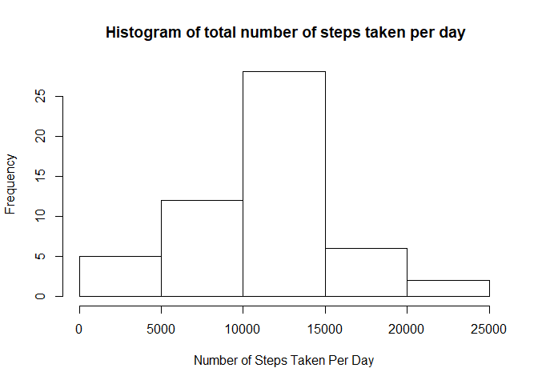
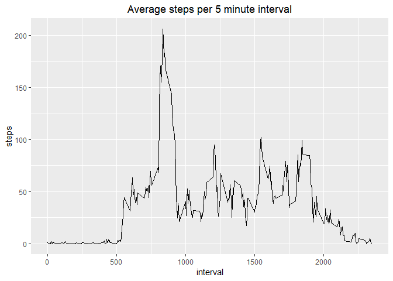
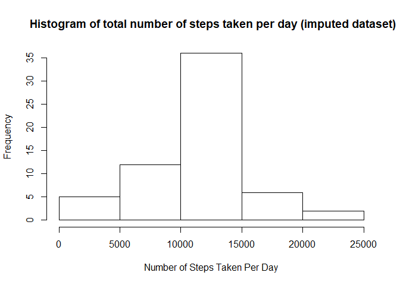
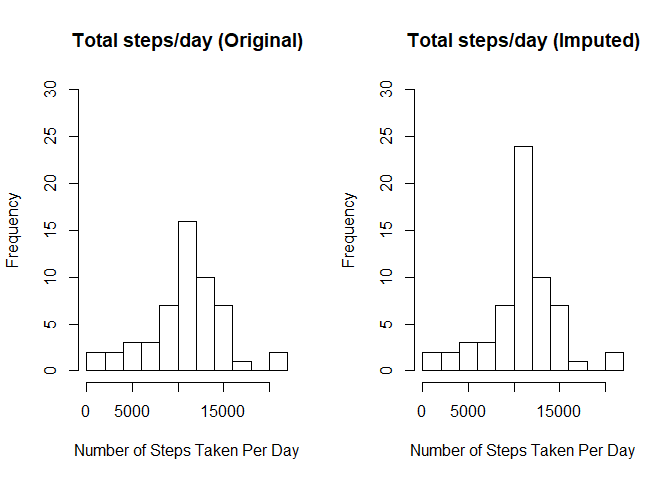

Load packages


```r
library(lubridate)
```

```
## 
## Attaching package: 'lubridate'
```

```
## The following object is masked from 'package:base':
## 
##     date
```

```r
library(dplyr)
```

```
## 
## Attaching package: 'dplyr'
```

```
## The following objects are masked from 'package:lubridate':
## 
##     intersect, setdiff, union
```

```
## The following objects are masked from 'package:stats':
## 
##     filter, lag
```

```
## The following objects are masked from 'package:base':
## 
##     intersect, setdiff, setequal, union
```

```r
library(ggplot2)
library(chron)
```

```
## 
## Attaching package: 'chron'
```

```
## The following objects are masked from 'package:lubridate':
## 
##     days, hours, minutes, seconds, years
```

```r
library(tinytex)
```

Load and summarize data


```r
activity.data <- read.csv("activity.csv")
summary(activity.data)
```

```
##      steps                date          interval     
##  Min.   :  0.00   2012-10-01:  288   Min.   :   0.0  
##  1st Qu.:  0.00   2012-10-02:  288   1st Qu.: 588.8  
##  Median :  0.00   2012-10-03:  288   Median :1177.5  
##  Mean   : 37.38   2012-10-04:  288   Mean   :1177.5  
##  3rd Qu.: 12.00   2012-10-05:  288   3rd Qu.:1766.2  
##  Max.   :806.00   2012-10-06:  288   Max.   :2355.0  
##  NA's   :2304     (Other)   :15840
```

Change date to date format


```r
activity.data$date <- as.Date(activity.data$date)
```

1: What is the mean total number of steps taken per day?
  
   1.1: Calculate the total number of steps taken per day

```r
total.steps.perday <- aggregate(steps ~ date, activity.data, FUN=sum, na.rm=TRUE)
```

   1.2: Plot Histogram

```r
hist(total.steps.perday$step, 
     xlab = "Number of Steps Taken Per Day",
     main = " Histogram of total number of steps taken per day")
```

<!-- -->

   1.3: Calculate mean and median of the total number of steps taken per day

```r
mean(total.steps.perday$steps)
```

```
## [1] 10766.19
```

```r
median(total.steps.perday$steps)
```

```
## [1] 10765
```

2: What is the average daily activity pattern?

   2.1: Make a time-series plot of the 5 min interval adn the avg. no. of steps taken, averaged across all days (y-axis)

```r
average.steps <- aggregate(steps ~ interval, activity.data, FUN=mean, na.rm=TRUE)
colnames(average.steps) <- c("interval", "steps")
ggplot(aes(x=interval, y=steps), data=average.steps)+geom_line() + ggtitle("Average steps per 5 minute interval") + 
  theme(plot.title = element_text(hjust=0.5))
```

<!-- -->

   2.2: Which 5-minute interval, on average across all the days in the dataset, contains the maximum number of steps?

```r
## Interval with maximum no. of steps
filter(average.steps, steps==max(steps))
```

```
##   interval    steps
## 1      835 206.1698
```


3: Imputing missing values

   3.1: Calculate the total no of missing values in original dataset

```r
sum (is.na(activity.data$steps))
```

```
## [1] 2304
```
   3.2: Replace missing values with mean no. of steps

```r
activity.data.new<-activity.data
for (i in 1:nrow(activity.data.new))
{
  if (is.na(activity.data.new$steps[i])){
    activity.data.new$steps[i]<-average.steps[which(activity.data.new$interval[i] == average.steps$interval),]$steps
  }
}
head(activity.data.new)
```

```
##       steps       date interval
## 1 1.7169811 2012-10-01        0
## 2 0.3396226 2012-10-01        5
## 3 0.1320755 2012-10-01       10
## 4 0.1509434 2012-10-01       15
## 5 0.0754717 2012-10-01       20
## 6 2.0943396 2012-10-01       25
```

```r
sum(is.na(activity.data.new))
```

```
## [1] 0
```

   3.3: Make a histogram of the total number of steps taken each day 

```r
total.steps.perday.new <-  aggregate(steps ~ date, activity.data.new, FUN=sum, na.rm=TRUE)
head(total.steps.perday.new)
```

```
##         date    steps
## 1 2012-10-01 10766.19
## 2 2012-10-02   126.00
## 3 2012-10-03 11352.00
## 4 2012-10-04 12116.00
## 5 2012-10-05 13294.00
## 6 2012-10-06 15420.00
```

```r
##Plot histogram
hist(total.steps.perday.new$step, 
     xlab = "Number of Steps Taken Per Day",
     main = " Histogram of total number of steps taken per day (imputed dataset)")
```

<!-- -->

   3.4: calculate mean and median of steps taken per day for imputed dataset

```r
mean(total.steps.perday.new$steps)
```

```
## [1] 10766.19
```

```r
median(total.steps.perday.new$steps)
```

```
## [1] 10766.19
```

   3.5: Compare original dataset and imputed dataset

```r
par(mfrow=c(1,2))

hist(total.steps.perday$step, 
     xlab = "Number of Steps Taken Per Day",
     main = "Total steps/day (Original)", 
     breaks = 10, 
     ylim=c(0,30))
hist(total.steps.perday.new$step, 
     xlab = "Number of Steps Taken Per Day",
     main = "Total steps/day (Imputed)",
     breaks = 10,
     ylim=c(0,30))
```

<!-- -->

4. Are there any differences in activity patterns between weekdays and weekends

   4.1 Create a new factor variable in the dataset with two levels "weekday" and "weekend" indicating whether a given date is a weekday or weekend        day.

```r
for (i in 1:nrow(activity.data.new))
{
  if(weekdays(as.Date(activity.data.new$date[i]))=="Saturday" |weekdays(as.Date(activity.data.new$date[i]))=="Sunday"){ 
    activity.data.new$weekdays[i]<-"weekend"
  }else{activity.data.new$weekdays[i]<-"weekday"}
}

mean.interval.new <- group_by(activity.data.new, interval,weekdays)
interval.data<-summarize(mean.interval.new, steps= mean(steps, na.rm = TRUE ))
```

  4.2 Make a panel plot containing a time series plot (i.e. \color{red}{\verb|type = "l"|}type="l") of the 5-minute interval (x-axis) and the     
      average number of steps taken, averaged across all weekday days or weekend days (y-axis). See the README file in the GitHub repository to   
      see an example of what this plot should look like using simulated data.

```r
qplot(interval,steps, data = interval.data,facets = weekdays~., geom="line")
```

<!-- -->


